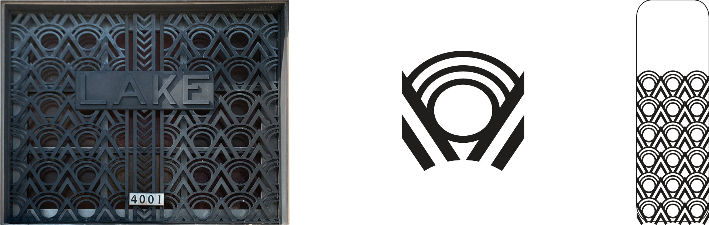

# producer-mic

This mic was created to work with Shure ULX-D and Axient Digital wireless systems. Prior to making this, producers at the venue was used a custom Countryman B3 mic wired into a PTT radio surveillance kit. While simple, this design was fragile, difficult to repair, and caused pops when the mic was turned on and off. So I decided to make a microphone that was difficult to repair but at least did not pop when it turned on and off.

## Design

I was looking at different triangle based patterns to put on the front of the mic. Could not get them to fit right. A few weeks later I found the perfect art deco pattern. This was found above the main entrance to the Town of Lake Water Tower and Municipal Building in Milwaukee Wisconsin.

## Circuit Design

Shure sells inline mute switches, these are often used by NFL Refs to talk to America. A schematic is posted in their knowledge base. The additional caps and resistors in this circuit help clean up small voltage spikes when the switch changes state.

The B3 capsule in the previous iteration of the mic is expensive, especially when it is just used for comm! It was originally chosen for its size, but we can go much smaller!

### Microphone

Yes, that is a microphone on a lego stud! This is a Knowles SPH6611LR5H-1. This $0.92 component is constructed using processes similar to how other ICs are made. The diaphragm and amplifier are etched out of silicon. This particular component is bottom ported, the audio passes through the bottom of the PCB into the microphone.

### Switch
For a Push-To-Talk, the switch needs normally be closed to mute the audio. Pressing the button should enable the mic. A SPST NC or SPDT switch is required. The NKK G3B15AH-R-YA was selected, it is a SMT right angle switch. Its a bit larger than I'd like but there are not as many options for SPDT right angle SMT switches.

## Schematic

I start by recreating the schematic for the Shure mute switch in [KiCad](https://www.kicad.org). There is one additional resistor to add. The microphone runs at 1.5V - 3.6V. We need to drop the 5V DC bias from the body back to that range.

|           |           |             |            |         |               |    |         |   |
|-----------|-----------|-------------|------------|---------|---------------|----|---------|---|
| Vin       | 5 V       |             |            |         |               |    |         |   |
| Vmin      | 1.5 V     |             | R1         | 10000 Ω |               |    |         |   |
| Vmax      | 3.6 V     |             | R2         | 8000 Ω  |               | R3 | 20000 Ω |   |
| Idd@1.8 V | 0.000145A |             |            |         |               |    |         |   |
|           |           |             |            |         |               |    |         |   |
|           |           | Voltage Div |            |         | Current Limit |    |         |   |
|           | RbodyPack | Vout        | Idiv       |         | Vout          |    |         |   |
| ATXD      | 0         | 2.222 V     | 0.00027778 |         | 2.1 V         |    |         |   |
| ULXD      | 1000 Ω    | 2.105 V     | 0.00026316 |         | 1.955 V       |    |         |   |
| QLXD      | 1000 Ω    | 2.105 V     | 0.00026316 |         | 1.955 V       |    |         |   |
| UHFR      | 500 Ω     | 2.162 V     | 0.00027027 |         | 2.0275 V      |    |         |   |

Shure sells a few different lines of wireless systems. Each bodypack supplies the bias voltage slightly differently. Lets check if we can find a combination of resistors that works with all models. In Excel I try out regulating voltage for the microphone by using a voltage divider (R1, R2) and a current limiting resistor (R3).  A 20kΩ current limiting resistor ends up fitting in perfectly. It is already in the mute portion of the circuit and brings drops the voltage into the 1.5V - 3.6V range for the capsule.

## Component Footprints
KiCad libraries include footprints for thousands of devices, but they don't include everything. Using the Footprint Editor, we create new layouts for the microphone and switch.

The microphone datasheet includes mechanical specifications, a pinout, and solder stencil pattern. Using these measurements and some basic math, we add pads that correspond to contacts on the microphone. The footprint editor lets us add pads to different layers of the footprint.

For the microphone, we define the footprint by these layers:
* Copper - This is where we want copper.
* Mask - This is where we want copper to be exposed.
* Paste - Where we want solder paste to be applied. This will be used to create a stencil.
* Silkscreen - This layer adds labels, polarity indicators, and other info to the PCB.
* Drill - Where holes will be drilled. These are often used to connect between layers of the PCB. For the microphone, it is used to create an acoustic port.

Additional custom footprints are created for the artwork on the front of the mic and the PTT button.

## PCB Layout

Each symbol in the PCB layout has a corresponding footprint. These footprints are added to the PCB. I know where I want the mic, switch and pads for the cable to go so those are placed first. From there, I place the rest of the components.

After everything is placed, the nets are turned into routes. I use the Route tool draw a path between pads of different components. Ground is done last, for that I use a pour to fill in the rest of the space with ground.

## Fabrication

The KiCad file goes off to [OshPark](https://oshpark.com) to be fabricated. OshPark makes a panel that includes the producer-mic pcb along with pcbs from dozens of other customers. They make it very easy and affordable to run small prototypes, this board cost $1.70!

The KiCad file also gets uploaded to [OshStencil](https://www.oshstencils.com/). They'll etch a stainless steel solder paste stencil using the paste layer we defined earlier.

|  |  |
|-----------------------------|---------------------------------|
|  |  |

Time to solder it up! The stencil is placed over the PCB, and the paste is applied by spreading the paste across. The components are applied to the board using a set of precision tweezers. Placement does not need to be perfect, as the flux evaporates, the surface tension of the solder will kind of pull the components into place. It is very cool to see! The boards go onto the hotplate. As the paste heats up, it goes from a grayish color to a metallic silver. When everything is silver, the board is done and can be removed to cool down.

## Case Design and Construction

The board outline is brought into Adobe Illustrator where the basic geometry of the enclosure can be worked out. I also created a model in AutoDesk Fusion360. My friend Dan, a skilled cabinetmaker, was able to cut a few prototypes out of scrap plastic material using an AVID cnc router. Once we had the fit right, it was cut out of wood.

The hole for the switch and wire are manually drilled using a drill press and a magnet is glued to the inside of the case. The cable is fished in and soldered to the board. The board is glued in place. The mic is finished!

## BOM
| **Description**        | **Model**      | **Manufacturer** | **Quantity** | **Price Each** | **Total Price** |   |   |   |
|------------------------|----------------|------------------|--------------|----------------|-----------------|---|---|---|
| 0.12uF 805 capacitor   | 08053C124JAT2A | KYOCERA AVX      | 1            | $0.24          | $0.24           |   |   |   |
| 150pF 805 capacitor    | 08051A151J4T4A | KYOCERA AVX      | 1            | $0.16          | $0.16           |   |   |   |
| MEMS microphone        | SPH6611LR5H-1  | Knowles          | 1            | $0.92          | $0.92           |   |   |   |
| 20k 805 Resistor       | ERJ-6ENF2002V  | Panasonic        | 2            | $0.03          | $0.06           |   |   |   |
| 100k 805 Resistor      | ERJ-6ENF1003V  | Panasonic        | 1            | $0.03          | $0.03           |   |   |   |
| SPDT Switch            | G3B15AH-R-YA   | NKK              | 1            | $6.60          | $6.60           |   |   |   |
| TA4F Connector         | RT4FC-B        | Neutrik          | 1            | $2.80          | $2.80           |   |   |   |
| Balanced Lav Mic Cable | W2901          | Mogami           | 6            | $0.67          | $4.02           |   |   |   |
|                        |                |                  |              |                |                 |   |   |   |
|                        |                |                  |              | **Total:**     | **$14.83 **     |   |   |   |
|                        |                |                  |              |                |                 |   |   |   |