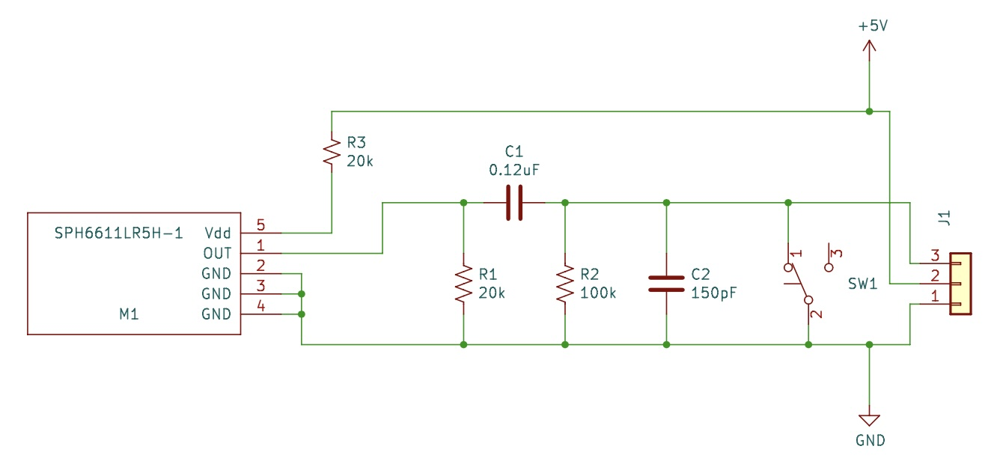

# producer-mic
This mic was created to work with Shure ULX-D and Axient Digital wireless systems. The venue was using a custom Countryman B3 mic wired into a PTT radio surveillance kit. While simple, this design was fragile, difficult to repair, and caused clicks when the mic was turned on and off.

## Circuit Design

Shure sells inline mute switches, these are often used by NFL Refs to talk to America. A schematic is posted in their knowledge base. The additional caps and resistors in this circuit help clean up small voltage spikes when the switch changes state.

The B3 capsule in the previous iteration of the mic is expensive, especially when it is just used for comm! It was originally chosen for its size, but we can go much smaller!

### Microphone

Yes, that is a microphone on a lego stud! This is a Knowles SPH6611LR5H-1. This $0.92 component is constructed using processes similar to how other ICs are made. The diaphragm and amplifier are etched out of silicon. This particular component is bottom ported, the audio passes through the bottom of the PCB into the microphone.

### Switch
For a Push-To-Talk, the switch needs normally be closed to mute the audio. Pressing the button should enable the mic. A SPST NC or SPDT switch is required. The NKK G3B15AH-R-YA was selected, it is a SMT right angle switch. Its a bit larger than I'd like but there are not as many options for SPDT right angle SMT switches.

## Schematic

I start by recreating the schematic for the Shure mute switch in [KiCad](https://www.kicad.org).

There is one additional resistor to add, R3. This will drop down the +5V DC bias voltage within the voltage range for the Knowles microphone.

